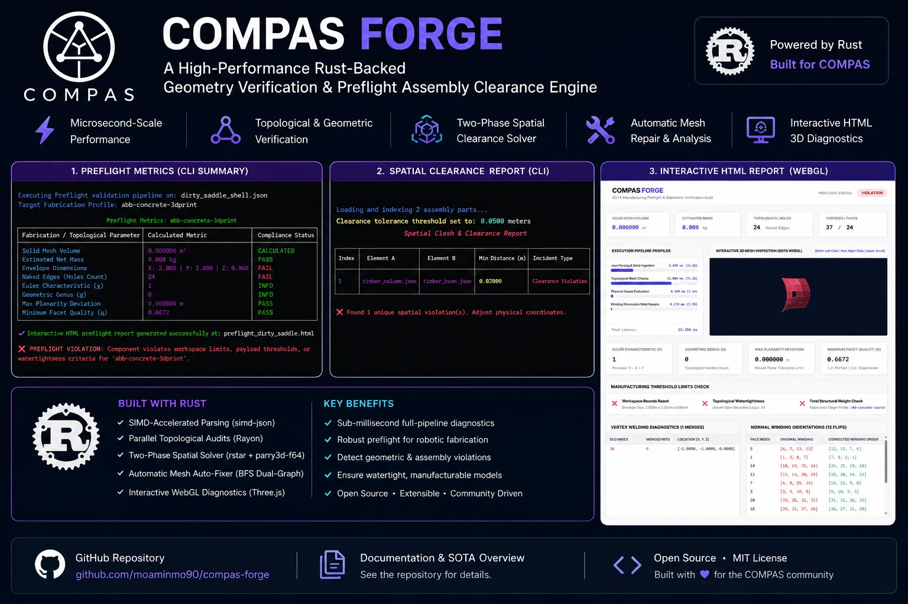
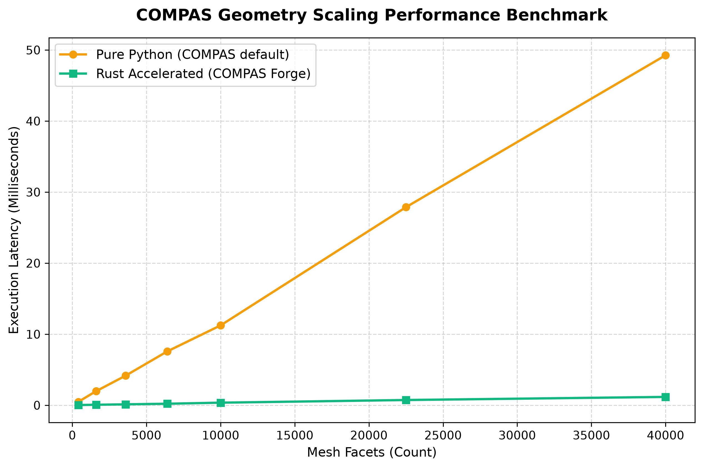

# COMPAS Forge 🛠️

<div align="center">
  <a href="LICENSE">
    
  </a>
  <a href="https://www.python.org/">
    
  </a>
  <a href="https://www.rust-lang.org/">
    
  </a>
  <a href="https://compas.dev/">
    
  </a>
  
</div>

> [!NOTE]
> **An Open-Source, High-Performance Rust-Backed Geometry Verification, Robotic Swept-Collision & Preflight Assembly Clearance Engine for the COMPAS Framework**

<div align="center">
  
</div>

COMPAS Forge is an open-source, high-performance geometry verification and digital fabrication preflight suite developed to bridge the gap between computational design environments (such as Rhino, Grasshopper, and Blender) and real-world physical manufacturing.

Bound to the **COMPAS** ecosystem, this library provides microsecond-precision topological and physical validation checks, optimizing CAD models before exporting them to robotic paths or CNC machinery.

*This is an open-source, research-oriented library designed for academic collaboration. We invite researchers, roboticists, and computational designers to contribute, extend fabrication profiles, and integrate advanced geometric solvers.*


---


## Key SOTA Architectural Features

* **Zero-Copy Memory Shared FFI (Pillar 1):** Directly transmutes flat contiguous C-compatible memory layouts (`PyBuffer`) between Python and parallel Rust threads without copy-pasting, eliminating $O(N)$ string serialization overhead.
* **Continuous Collision Detection (CCD) with Rotational Sub-Stepping (Pillar 2):** Supports simultaneous translation and rotation (helical sweep toolpaths) using piecewise temporal sub-stepping, evaluating exact Time of Impact (TOI) down to 6 decimal places in microseconds.
* **Parallel Assembly Contact Solver (Pillar 3):** Combines parallel R-Tree broad-phase spatial filters with a robust 2D **Sutherland-Hodgman Polygon Clipper** to extract exact contact areas, centroids, and normals across thousands of adjacent blocks in milliseconds.
* **Universal COMPAS 1.x / 2.x Schema Parser:** Embedded dual-format JSON deserializer that natively resolves both nested arrays and string-keyed maps, solving version compatibility breaks seamlessly.
* **Transparent Plugin Acceleration (Pillar 4):** Integrated with COMPAS core plugin auto-discovery. Standard queries like `.is_manifold()` and `.is_closed()` are transparently intercepted and solved by the Rust engine.


---


## Scaling Performance Benchmark

We evaluated the performance of the transparent plugin acceleration by querying `.is_closed()` on dense parametric geodesic dome structures. COMPAS pure-Python execution times are compared against COMPAS Forge's Rust FFI memory shared engine:

| Mesh Facets (Count) | Pure Python (ms) | Rust Forge FFI (ms) | Speedup Factor |
| :--- | :--- | :--- | :--- |
| **400** | 0.476 ms | 0.031 ms | **15.35x** |
| **1,600** | 1.975 ms | 0.070 ms | **28.41x** |
| **3,600** | 4.169 ms | 0.129 ms | **32.29x** |
| **6,400** | 7.576 ms | 0.215 ms | **35.27x** |
| **10,000** | 11.240 ms | 0.362 ms | **31.06x** |
| **22,500** | 27.878 ms | 0.737 ms | **37.85x** |
| **40,000** | 49.254 ms | 1.173 ms | **41.99x** |

At **40,000 facets**, pure-Python COMPAS takes **~49 ms** to resolve watertightness, dropping the viewport frame rate below the interactive threshold (~20 FPS). COMPAS Forge processes the same geometry in **1.17 ms (~850 Hz)**, enabling lag-free real-time manipulation in CAD viewports (Rhino 8 / Grasshopper).

<div align="center">
  
</div>


---


## Installation

### Standard Installation

Once released, COMPAS Forge can be installed from PyPI:

```bash
pip install compas-forge
```

### Installation from Source

Requirements:
- Rustc 1.96+
- Python 3.11+

```bash
git clone https://github.com/moaminmo90/compas-forge.git
cd compas-forge
pip install -e .
```


---


## Python API Usage Guide

### 1. Transparent COMPAS Core Acceleration
Simply install `compas_forge`. Native COMPAS queries are transparently routed to the Rust core under the hood:

```python
from compas.datastructures import Mesh

mesh = Mesh.from_json("dense_model.json")

# Executed natively in Rust in microseconds!
if mesh.is_manifold() and mesh.is_closed():
    print("Mesh is valid and watertight.")
```

### 2. Rotational Continuous Collision Detection (CCD)
Evaluate continuous swept trajectories of simultaneous translations and rotations:

```python
import compas_forge

# Pose: [x, y, z, qx, qy, qz, qw]
pose_a_start = [-2.5, 0.0, 0.0, 0.0, 0.0, 0.0, 1.0]
pose_a_end   = [ 2.5, 0.0, 0.0, 0.0, 0.0, 0.707, 0.707] # Rotates 90 deg

result = compas_forge.check_swept_collision_zero_copy(
    mesh_a, pose_a_start, pose_a_end,
    mesh_b, pose_b_start, pose_b_end
)

if result["has_collision"]:
    print(f"Collision at Time of Impact: {result['time_of_impact']:.6f} s")
```

### 3. Assembly Contact Solver (Sutherland-Hodgman)
Extract exact contact polygons, centroids, and areas from touching blocks:

```python
import compas_forge

blocks = {"block_0": mesh_0, "block_1": mesh_1}
contacts = compas_forge.compute_assembly_contacts_zero_copy(blocks, tolerance=0.005)

for contact in contacts:
    print(f"Contact between {contact['block_a']} and {contact['block_b']}")
    print(f"Contact Area: {contact['area_m2']} m² | Centroid: {contact['centroid']}")
```


---


## CLI Usage Guide

```bash
# 1. Run general diagnostics
python -m compas_forge check my_mesh.json

# 2. Run continuous swept-collision
python -m compas_forge swept mesh_a.json -2.5,0,0,0,0,0,1 2.5,0,0,0,0,0.7,0.7 mesh_b.json 0,0,0,0,0,0,1 0,0,0,0,0,0,1

# 3. Resolve assembly contacts
python -m compas_forge contacts block_1.json block_2.json --tolerance 0.005
```


---


## Examples & Reproducibility Sandbox

We provide ready-to-run educational scripts inside the `examples/` directory to demonstrate and replicate our SOTA algorithms instantly:

1. **Zero-Copy Mesh Healing (`examples/example_zero_copy_healing.py`):** Repairs 1,000s of vertex duplicates and face normal directions in-memory and reconstructs a healthy COMPAS Mesh in milliseconds.
2. **Rotational Sweep Collision (`examples/example_continuous_collision.py`):** Runs continuous swept collision detection on two moving, rotating objects.
3. **Voussoir Arch Assembly Solver (`examples/example_assembly_contacts.py`):** Synthesizes a 30-block voussoir arch and solves 29 contact interfaces with centroids and normal vectors in milliseconds.

To run any example:
```bash
python examples/example_zero_copy_healing.py
```

To regenerate the scaling benchmark chart:
```bash
python generate_benchmarks.py
```


---


## Mathematical Formulations & Algorithms

### 1. Mesh Volume via Gauss's Divergence Theorem
$$
V = \frac{1}{6} \sum_i \mathbf{p}_0 \cdot \left(\mathbf{p}_1 \times \mathbf{p}_2\right)
$$

### 2. Best-Fit Newell Plane & Planarity Deviation
$$
n_x = \sum_{i=0}^{N-1} (y_i - y_{i+1})(z_i + z_{i+1})
$$
$$
n_y = \sum_{i=0}^{N-1} (z_i - z_{i+1})(x_i + x_{i+1})
$$
$$
n_z = \sum_{i=0}^{N-1} (x_i - x_{i+1})(y_i + y_{i+1})
$$

The maximum perpendicular distance $d_{max}$ of any vertex $\mathbf{v}_i$ to the centroid plane $\mathbf{c}$ is evaluated as:
$$
d_{max} = \max_i \left|(\mathbf{v}_i - \mathbf{c}) \cdot \mathbf{n}\right|
$$

### 3. Topological Invariants (Euler & Genus)
$$
\chi = V - E + F
$$
$$
g = \frac{2 - \chi}{2}
$$


---

## Author

- **GitHub:** <https://github.com/moaminmo90>
- **LinkedIn:** <https://www.linkedin.com/in/moaminmo90>

---

## License

Licensed under the **MIT License**.
